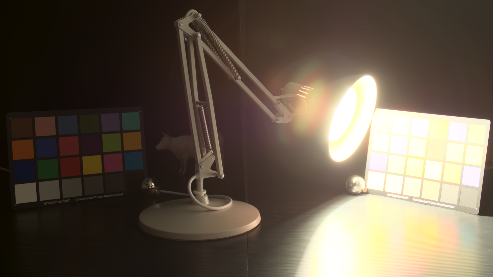

# FidelityFX LPM

### What is LPM?
Luma Preserving Mapper is a tone mapping and gamut mapping solution for HDR and wide gamut content. LPM tone maps the luma of the RGB pixel instead of the colors itself, but it makes sure that tonemap(luma(RGB)) would be very similar to luma(tonemap(RGB)), that is, it preserves the luma of the pixel.

### Sample Overview:

- This sample is meant to show LPM integration into DX12 and Vulkan API.
- LPM is a single header tone and gamut mapping solutions tailored to work for HDR and wide gamut colour pipelines and displays.

#### FidelityFX LPM Off
 

#### FidelityFX LPM On


# Build Instructions

### Prerequisites

- To build LPM Sample, install the following tools:

    - [CMake 3.4](https://cmake.org/download/)
    - [Visual Studio 2017](https://visualstudio.microsoft.com/downloads/)
    - [Windows 10 SDK 10.0.18362.0](https://developer.microsoft.com/en-us/windows/downloads/windows-10-sdk)
    - [Vulkan SDK 1.2.131.1](https://www.lunarg.com/vulkan-sdk/)

#### Running the LPM Sample:

- Clone the repo with its submodules: 

  ```
    > git clone https://github.com/GPUOpen-Effects/FidelityFX-LPM.git --recurse-submodules
  ```

- Generate the solutions: 

   ```
    > cd sample/build
    GenerateSolutions.bat
   ```

- Open the solutions in the VK or DX12 directories, compile and run.
- The tonemapper selected in GUI will already be set to LPM.
- If using HDR10 or FS2 displays, you can also change display mode option in UI.
- Use test pattern option in UI to do accuracy testing of LPM on different colour swatches or test HDR photograph image.

### High-level overview:

For a detailed explanation of LPM, please read sample/docs/LPM_doc.pdf and read the comments in ffx-lpm/ffx_lpm.h.

LPM is split into two parts: a setup call and filter call. The setup call writes pertinent data to a fixed size control block with regards to what the tone and gamut mapping calculations need and the filter call reads from the control block and calculates and outputs a tone and gamut mapped color value or pair of values for the FP16 version.

ffx_lpm.h:
 - A common header file for CPU side setup of the mapper and GPU side setup and tone and gamut map calculation functions.
 - LpmSetup() used to setup all the data required by mapper in a control block.
  - Information like:
   - What is the content gamut.
   - What is the display gamut.
   - Max brightness value of content in RGB.
   - Exposure steps above SDR/LDR 1.0
 - LPMFilter() used to do the calculations for mapper by reading data from the control block.
 - For detailed intructions please read comments in ffx_lpm.h

LPMPS.cpp:
 - CPU side setup code for LPM.
 - Select the right LPM_config_*_* and LPM_color_*_* configurations based on content gamut and display mode selected.

LPMPS.hlsl/glsl:
 - GPU side call to do the tone and gamut mapping.
 - Select right configurations of LPM_config_*_* based on content gamut and displaymode selected.
